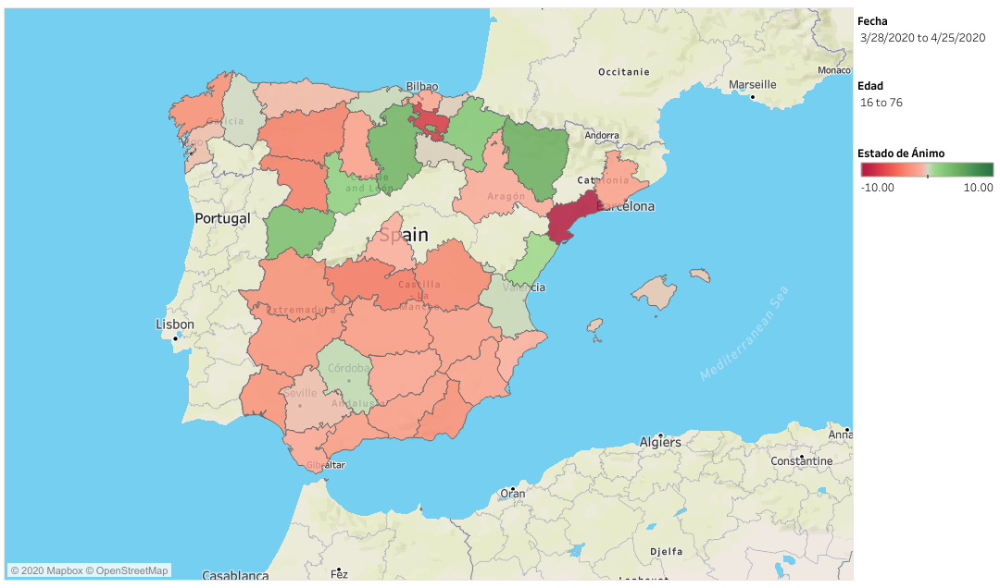
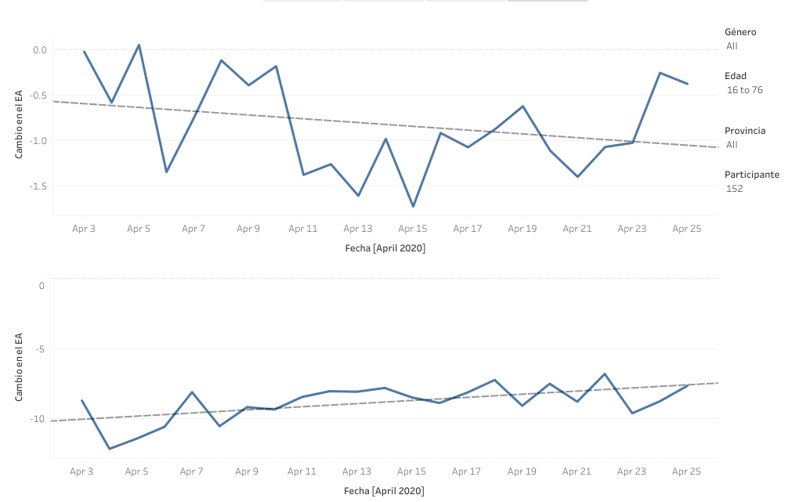
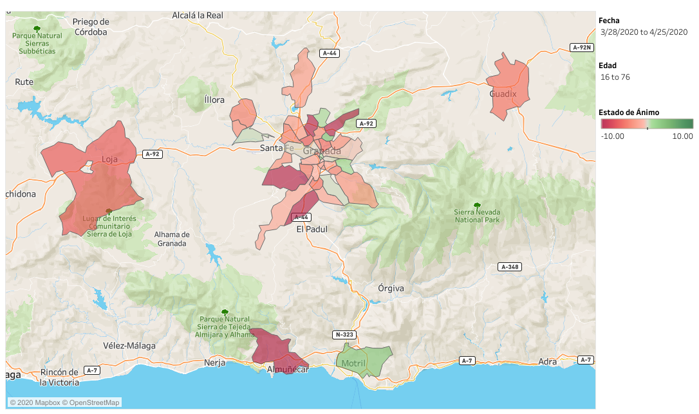

# CoVidAffect [https://covidaffect.info](https://covidaffect.info)
Real-time, geolocalized data of mood variations following the COVID-19 crisis

# Background
The COVID-19 outbreak and the ensuing confinement measures are expected to bear a significant psychological impact on the affected populations. Here, we publish a dataset from CoVidAffect, a citizen science project that was launched to provide direct, geolocalized data, of individual changes in subjective feeling and physical arousal following the COVID-19 crisis. These publicly available data are continuously updated and visual summaries are displayed on the project website. The data can be further analyzed to identify affected geographical regions, quantify emotional responses to specific measures and policies, and to understand the effect of context variables, such as living space, employment status, and practice of physical exercise, on emotional regulation and psychological resilience. Our goal is to offer a resource that will help to anticipate the needs for psychosocial support and facilitate evidence-based policy making.

# Preprint
You can read more details about the data acquisition method in our preprint:

# Data Records
The data are stored in three distinct CSV files located at the `datasets` directory.

## participants.csv
The file **participants.csv** stores data from the initial participation questionnaire and includes the following variables:

**id** – Unique identifier for each participant. This variable is used to merge the three databases.

**registered_date** – Date of registration in the database in the form: DD/MM/YYYY HR:MM:SS.

**sex** – Gender of each participant. Possible values are: feminine, masculine and other.

**age** – Age of each participant ranging from 16 to 100+ years with all intermediate values possible.

**country** – The participant’s country of residence.

**postcode** – The participant’s postal code that is used for geolocation.

**family** – Numeric value that codes the number of people in the residence. Possible values are: 1 (“I live alone”), 2, 3, 4, 5, and 6+.

**family_ages** – Age of each one of the residents included in the variable family.

**family_relation** – The relationship between the participant and each one of the residents included in the variable family. Possible comma separated values are: parent, partner, child, sibling, grandparent, grandchild, other, any (=no family relation).

**type_living** – Housing type. Possible values are: study, apartment, house, residence, chalet, other.

**living_rooms** – When type_living is set to apartment, house, or chalet, this numeric variable codes the number of rooms (1, 2, or 3+).

**open_spaces** – Access to open spaces. Possible comma separated values are: balcony, garden, yard, other, no.

**work_previous** – Employment status before the crisis. Possible values are: employee, self (self-employed), unemployed, student, retired, other.

**work_actual** – Current employment status before the crisis. Possible values are: same, new, telework, erte (temporary employment suspension), fired, increased, reduced, other.

**income** – Net monthly income. Coded in 10 possible ranges (in Euros): 0-500, 500-1000, 1000-1500, 1500-2000, 2000-2500, 2500-3000, 3000-5000, 5000-7000, 7000-9000, 9000+.

**negative_economy** – Binary flag to code the participant's perception on whether the crisis has negatively affected their economic situation (0=’no’, 1=’yes’).

**covid** – Codes presence of COVID-19 symptoms. Possible values are: no, not_reported (symptomatic but not officially diagnosed), reported (officially diagnosed with COVID-19).

**covid_family** – Codes presence of COVID-19 symptoms in other residents. Possible values are: no, not_reported (symptomatic but not officially diagnosed), reported (officially diagnosed with COVID-19).

**activity** – Codes the number of hours dedicated to physical exercise before the crisis. Possible values are: 0-2, 2-4, 4-6, 6-8, 8+.

**valence** – Valence rating before the crisis in a scale from -50 (negative) to +50 (positive).

## mood.csv
The file **mood.csv** stores data from each valence/arousal rating, recorded either on the web or via the smartphone app. It includes the following variables:

**participant** – Unique identifier for each participant. This variable coincides with the variable id in participants.csv and can be used to merge the two datasets.

**timestamp** – A timestamp (DD/MM/YYYY HR:MM:SS) identifying the exact date and time the notification was launched by the smartphone app.

**answer_timestamp** – A timestamp (DD/MM/YYYY HR:MM:SS) identifying the exact date and time the recording was registered by the participant. In case the recording was delivered online (not through the app), this variable coincides with the variable timestamp.

**valence** – Current valence rating in a scale from -50 (negative) to +50 (positive).

**arousal** – Current arousal rating in a scale from 0 (calm) to 100 (excited).

## context.csv
The file **context.csv** stores data from the supplementary questions recorded once per week by the subsample of the participants using the smartphone app. It includes the following variables:

**date** – The date the questions were launched (always on Friday at 20:00, Madrid Time zone) in the form DD/MM/YY.

**participant** – The participant’s unique identifier.

**covid_diagnosed** – Binary flag (‘Yes’ or ‘No’) to code whether the participant was diagnosed with COVID-19 during the past week.

**covid_house_diagnosed** – Binary flag (‘Yes’ or ‘No’) to code whether another resident was diagnosed with COVID-19 during the past week.

**covid_family_diagnosed** – Binary flag (‘Yes’ or ‘No’) to code whether another family member, or beleved person (not among the house residents) was diagnosed with COVID-19 during the past week.

**perceived_health** – The participant’s perception on their general health status rated in a scale from 0 to 5. 

**work_changed** – Codes changes in the participant’s employment status. Possible values are: no, telework, reduce, increase, erte (temporary employment suspension), fired, new, other.

**activity** – Hours dedicated to physical activity during the past week: 0-2, 2-4, 4-6, 6-8, 8+.

**social_contact** – Codes social contact frequency in the past week compared with social contact before the crisis. Possible values are: same, less, more.

**sleep** – Codes sleep quantity in the past week compared to normal. Possible values are: lot_less, less, same, more, lot_more.

# Technical Validation
To ensure data reliability, participants that submit mood data through the website are required to introduce their identification number and postal code, which are checked against the existing registers in the database. This step is not required when answering through the smartphone app.

The database is periodically checked to identify possible duplicate records. We consider answers by the same participant with the same notification launch timestamp as duplicates and keep only the first register.

# Usage Notes
To demonstrate potential uses of the data, on the project’s website we display territory maps showing the change of subjective feeling (valence) following the COVID-19 outbreak (Fig. 1). This is calculated by first estimating the average difference for each participant (average valence – pre-COVID19 valence recorded in the initial questionnaire) and then averaging across participants. The data on the maps can currently be calculated and displayed for any specific date and age range, while more analysis and visualization options will be offered as they become relevant.

To stress the dynamical and longitudinal characteristics of the data, we also present linear graphs showing the evolution of changes in subjective feeling as a function of time (Fig. 2). Users can use the filter options to display the average for any Spanish province and contrast it with their own data displayed when introducing their participant number.

Finally, although the main map uses Spanish provinces as a geographical unit, a finer spatial resolution is possible using the postal code provided by the participants. To demonstrate this possibility we also display a more detailed map of the Granada province with postal code areas used as geographical units (Fig. 3).

All maps and figures displayed at the project’s website were created using the [Tableau Public software](https://public.tableau.com). Geolocalisation was accomplished using the participants’  postal codes and Tableau’s built-in databases.